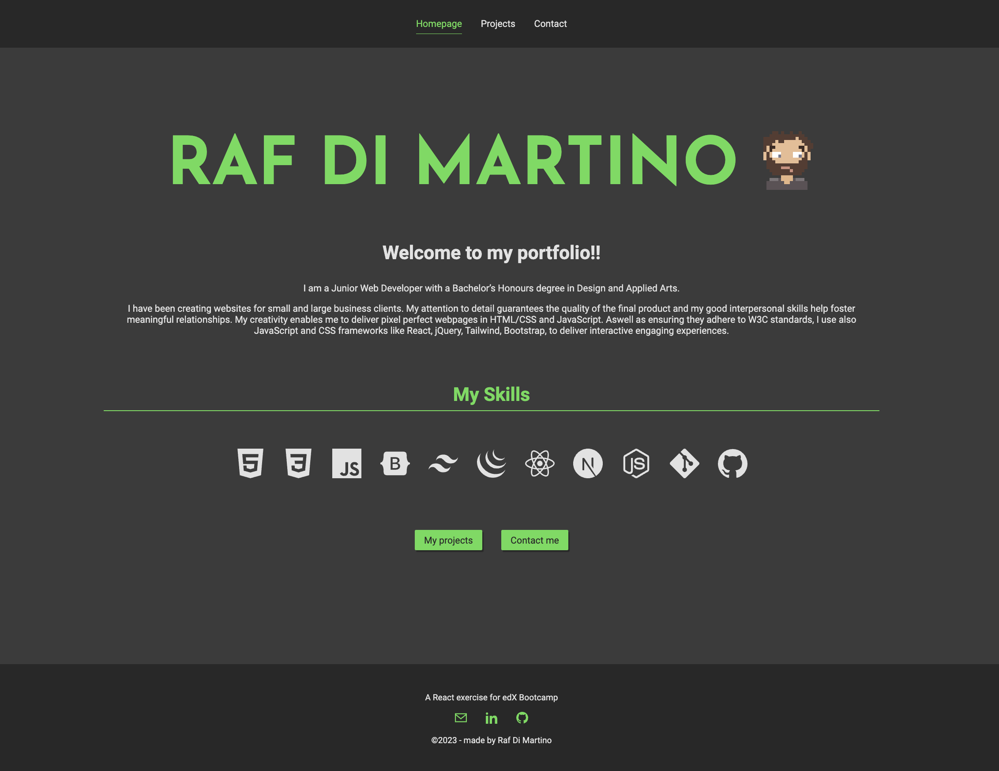

# Modern Development with React: React Portfolio

## Description
In this assignement my task was to create a Personal Portfolio Webpage using React.js,
and React-router-dom.

The project includes the following components as per acceptance criteria: 

- App
- Header
- Home page
- Projects page
- Project (on Projects page)
- Contact page

Other components:
- Contact form
- Skills
- Social Media
- Footer
- Scroll to top

As an additional task I have introduced Web3Form to receive the form submission on my personal email address.

The portfolio site is fully responsive following mobile-first design.

### Link to the deployed application 
https://rafdimartino.github.io/rafdimartino-react-portfolio/

## Tests
The application presents no error both in the development enviroment and in in the deployed application

## Installation
N/A

## Usage
The React Portfolio page is deployed on Github Pages so you can access it by clicking [here](https://rafdimartino.github.io/module-13-challenge-react-portfolio)

## License
This software is distributed under the MIT-licence

